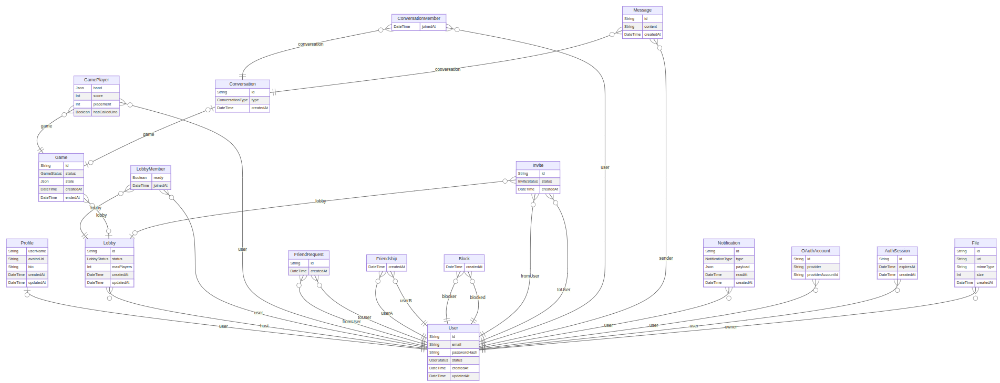

_This project has been created as part of the 42 curriculum by grial, ilazar, jslusark, wlucke._

# transcendence

Our final project for the 42 school common core.
A real-time multiplayer UNO card game: Play UNO with up to 4 people, chat in real time, track your stats on a leaderboard and more!

---

## Description

**Project name:** Transcendence (UNO)

**Our Goal:** Our main goal for this project was mainly to learn full stack web development principles. Most of our previous projects were based on low level programming languages and old programming libraries, this has been our first project to use a modern development stack, So we decided to build a simple single-page web application of a game that everyone knows and likes, UNO!

The project is a website hosting a real-time multiplayer UNO. The game is a classic card game where players take turns matching a card in their hand with the current card shown on top of the deck either by color or number. The goal is to be the first player to get rid of all their cards. The game includes special action cards that can change the flow of the game, such as Skip, Reverse, Draw Two, Wild, and Wild Draw Four cards.

multiplayer game where users can play against each other in real time, chat with each other and track their stats on a leaderboard. The project is built with a modern web development stack and we wanted to use this project as an opportunity to learn and practice full stack web development principles.

Build a single-page web application where users can play the UNO card game against each other in real time. All communication between frontend and backend is encrypted via HTTPS. The project demonstrates mastery of full-stack web development, real-time networking, game logic, and DevOps practices.

**Key Features:**

- 👤 **User accounts:**
  User can create an account by providing email, username, and password. Users must have a unique email and username.
- 🔐 **Account Security:** we use different security measures to ensure that user data is protected. From hashing passwords with bcrypt to rate-limiting requests, protecting input and
  storing JWT tokens in HttpOnly cookies on the backend and frontend.
- 🙋‍♂️ **User profile data**  
  Each user gets a profile page showing their username, avatar and user data such as: - Account creation date - Winning points - Total matches played - Winning rate between wins and losses - Rank placement in global Leaderboard - Match history with opponent names, dates, results, and avatars.
  User Profiles can be accesed only on login and are private to the user by default.
- 🥷 **New player detection:** since new users have no game data yet, we show personalised account to make them feel welcomed and guided enough to start their first game.
- 🪪 **Experience Badges:**
  Users can earn badges based on how much they play and how many games they win. From the newbie badge for first-time players to the master badge for those who have won a significant number of games, these badges serve as a visual representation of a user's achievements and progress within the game.
- 🏆 **Global leaderboard**: all users are ranked by the number of total wins and games played. A tie breaker is used to rank users with the same score. Users with no game data are included in the leaderboard but without rank placement.
  Each user in the leaderboard has their username, avatar, wins, and losses. Unranked users (0 games) appear at position 0.
- 🥊 **Match History:** all completed matches are stored in the database and can be accessed by the user on their profile page. Each match shows the opponents names, avatars, results (win/loss), room names and match dates.
- 📋 **Game Room Handling system:** users can create a room with a custom name or join an existing one via a unique room name. Each room can hold 2–4 players. If a player leaves the room during a game, they are not kicked out immediately but instead, a 30-second grace timer starts to allow them to rejoin (for example, if they accidentally close the tab, disconnected or navigate away).The room handling system covers many different scenarios to ensure a smooth user experience.
- 🃏 **Uno game engine**: the game is implemented in a custom-built engine that handles all UNO rules and edge cases. The game ends when a player empties their hand, a game result is shown to all players and the game results are saved in the database. Players who leave the game before completion are not counted in the final results. The game also handles when player is abandoned from their opponent, in this case the game is interrupted and not saved in the database.
- 💬 **In-Room Chat System:**
  When joining a game, users can interact with each other via chat.
  Our chat system provides room event notifications, allows players to send messages to each other and provides the full chat history of a room.
  As the chat history is saved in memory, it does not persist after the room is closed.
- ✨ **Interactive web interface:** the frontend is made with React and is not only responsive but also provides an interactive experience with animations, real-time updates and a smooth user experience, additionally to the grapichs from the game canvas.
- 🚪 **Gated routes handling:** all routes are protected and require authentication. Users must be logged in to access the app. Unauthenticated users are redirected to the login page.

- 📞 **https connection:** all communication between frontend and backend is encrypted via HTTPS. TLS termination is handled by NGINX, which proxies plain HTTP to the backend over Docker's internal network. Self-signed certificates are generated for local development by `make certs`. We also handle http to https redirection on port 80 for user convenience.
- 🐳 **Full Docker Environment**: the project ships as four Docker Compose services connected over a shared bridge network:
  - `nginx` (NGINX 1.27-alpine): is the only service exposed to the host (ports 8443 for HTTPS, 80 for HTTP to HTTPS redirect). Terminates TLS, proxies `/api/` and `/socket.io/` to `api:3000`, and everything else to `web:5173`. Serves static avatars from a shared volume.
  - `db` (PostgreSQL 16-alpine): stores users, profiles, games, and placements. Only the `api` service talks to it directly.
  - `api` (Fastify + TypeScript): handles auth, game logic via `gamelogic/`, room management via `gameManager/`, and real-time communication via Socket.IO. Exposes port 3000 internally. Depends on `db` being healthy before starting.
  - `web` (React 19 + Vite 7): dev server on port 5173. Proxied through NGINX, never exposed directly. All API calls use relative paths (`/api/*`, `/socket.io/*`) so they go through the same HTTPS origin.

  Flow: browser → `https://localhost:8443` → NGINX terminates TLS → proxies REST to `api`, WebSocket upgrades to `api`, static/SPA requests to `web`. `api` queries `db` over the internal Docker network. Nothing except NGINX is reachable from outside the container.

---

## Instructions

### Prerequisites

| Tool           | Version | Purpose                        |
| -------------- | ------- | ------------------------------ |
| Docker         | 24+     | Container runtime              |
| Docker Compose | 2+      | Multi-container orchestration  |
| Make           | (any)   | Build automation               |
| OpenSSL        | (any)   | SSL certificate generation     |
| Node.js        | 20+     | Required for `.env` generation |

### Quick Start

1. Clone the repository then run:

```bash
make           # or 'make setup' — full clean build from scratch
```

This will allow you to setup the project for running in one single command as it will do the following:

- Create `.env` with random secure credentials
- Generate self-signed SSL certificates
- Clean any previous Docker state
- Build & start all 4 containers (db, api, web, nginx)
- Push the Prisma schema to PostgreSQL
- Seed the database with test users and game history
  These commands can also be executed individually for build, testing and debugging purposes.
  Check the [makeFile](./Makefile) to access view all info of the different available commands and their purpose.

2. **Check the terminal output:**
   At the end of the build process, you should see the following output which shares:

- the URL to access the app
  `✅  App running at https://localhost:8443`
- the IP address of your machine for other devices on the same network:
  ` 🌐  Other devices: https://192.168.178.183:8443`

  3.**Open the app:** visit `https://localhost:8443` and accept the self-signed certificate warning.

4. **Login:** create a new account or use one of the seeded test users below:

| Username | Email               | Password     |
| -------- | ------------------- | ------------ |
| alice    | alice@example.com   | Alice12345   |
| bob      | bob@example.com     | Bob12345     |
| charlie  | charlie@example.com | Charlie12345 |

4. **Play:** open a second browser or incognito window or access the app from another device on the same network using the IP address shown in the terminal. Log in with a different account and create/join a room to start playing.

5. **To stop the app:** there are different ways to stop the app

- `make down`: stops the 4 project containers but keeps everything else but preserves the database volume, built images, and Docker network. This is good for stopping the app for a while and resuming later.
- `make clean`: like `make down` but also deletes the database and orphaned images, networks, and volumes associated with this project. Great for a full reset of the project without affecting other Docker projects on your machine.
- `make prune`: removes everything related to Docker on your machine. Use this if Docker is eating your disk space. After pruning, the next `make up` has to rebuild images from scratch (no cache).

### Environment Variables (`.env`)

We automatically generate a `.env` file to easily configure the project for local development, it is done via `make env` which is also called by `make` or `make setup`.

The `.env` file is **never** committed to the repository, it is ignored by Git to ensure it never gets pushed to the repository.
We only provide a `.env.example` placeholder as requested by the subject. The `.env` file contains sensitive credentials and should be kept private.

| Variable                                              | Purpose                                                 |
| ----------------------------------------------------- | ------------------------------------------------------- |
| `POSTGRES_USER` / `POSTGRES_PASSWORD` / `POSTGRES_DB` | Database credentials                                    |
| `DATABASE_URL`                                        | Prisma connection string                                |
| `JWT_SECRET`                                          | JWT signing key                                         |
| `EXPOSE_DEV_TOKENS`                                   | Dev-only: expose tokens in API responses for test suite |

---

## Resources

### Project Documentation and resources

During the project we have used a long series of resouces and tools:

- [Project Documentation](docs/) — detailed architecture, design decisions, and verification steps
- [Project Kanban Board](https://github.com/orgs/42-Hitchhikers-Collective/projects/5): to organize tasks, track progress, and manage team collaboration.
- [Project Notion](https://app.notion.com/p/42wolfsburgberlin/Transcendence-2e9937251cae8026ac8ee6f59b496509)
- [TypeScript Style guide](https://google.github.io/styleguide/tsguide.html)
- [Conventional Commits specification](https://www.conventionalcommits.org/en/v1.0.0/)
- [Http requwsts vs WebSocket communication](https://blog.postman.com/websockets-vs-http-key-differences-explained/)
- [UNO Official Rules](<https://en.wikipedia.org/wiki/Uno_(card_game)>)
- [Fastify Documentation](https://fastify.dev/docs/)
- [Prisma Documentation](https://www.prisma.io/docs)
- [Phaser 3 Documentation](https://photonstorm.github.io/phaser3-docs/)
- [Socket.IO Documentation](https://socket.io/docs/v4/)
- [Docker Documentation](https://docs.docker.com/)
- [React Documentation](https://react.dev/learn)
- [TailwindCSS Documentation](https://tailwindcss.com/docs/installation)
- [Shadcn/ui Documentation](https://ui.shadcn.com/docs)
- [Vite Documentation](https://vitejs.dev/guide/)

### AI Usage

AI assistants were used throughout the project for:

- **Brainstorming** — researching solutions, generating ideas, and exploring alternative approaches to problems.
- **Debugging**: Ai has been incredibly useful when debugging partner code and identifying missing data or misconfigurations, especially in cases where we couldn't communicate directly with the author. It has helped us understand code we did not own and fix issues quickly, avoiding potential delays in our development process.
- **Documentation**: recording important findings in notes and finalising documentation for the project.

All AI-generated code was reviewed and tested, thoroughly, human verification was a must to ensure correctness and functionality.

---

## Team Information

- grial: Game developer across backend (UNO engine) and frontend (Phaser canvas). Designed and built the core game mechanics (card logic, rule enforcement, turn management) and integrated the game engine with the real-time socket layer.

- ilazar: Backend developer focused on real-time communication and room management. Built the Socket.IO layer, room lifecycle (create/join/leave), online players tracking, chat, drop timer and reconnection system.

- jslusark: Full-stack developer and project manager. Organised and coordinated team efforts, deadlines, feature planning, and code reviews. Contributed to both frontend (UI, routing, authentication, state management) and backend (final feature implementations, bug fixes and optimizations).

- wlucke: Backend developer focused on authentication, user management, and database. Built the register/login system with JWT cookies, user profiles with avatar upload, leaderboard and game history, and the Prisma + PostgreSQL data layer.

---

## Project Management

| Practice            | Approach                                                                                            |
| ------------------- | --------------------------------------------------------------------------------------------------- |

| **Task Tracking**   | GitHub Kanban Board for task management, progress tracking, and team collaboration                  |
| **Code Reviews**    | In-person pair programming, testing and merge sessions on campus |
| **Documentation**   | Notion (architecture decisions, meeting notes, availability tracking) + Markdown docs in `docs/`                           |
| **Communication channels**   | Slack and Whatsapp for daily updates and sync meetings                                              |

---

## Technical Stack

### Architecture

```
Browser ──HTTPS──▶ NGINX ──proxy──▶ Fastify API (:3000)
                         │
                         ├──proxy──▶ Vite Dev Server (:5173)
                         │
                         └──WSS──▶ Socket.IO (via /socket.io/)
                                    │
                                    └──▶ PostgreSQL (:5432)
```

### Frontend

| Technology                | Purpose                                        |
| ------------------------- | ---------------------------------------------- | ------------ | --- |
| **React 19**              | component-based library for SPA                |
| **TypeScript 5**          | Type-safe development                          |
| **Vite 7**                | Dev server + build tool                        |
| **TailwindCSS 4**         | CSS library                                    |
| **Shadcn**                | Built in React components                      |
| **React Router v7**       | Client-side routing                            |
| **Phaser 3.90**           | 2D game canvas (UNO board, cards, drag & drop) |
| **React Hook Form + Zod** | Form handling + schema validation              |
| **Lucide React**          | Icons                                          |
| **Motion**                | Css Animations                                 |
| <!--                      | **Recharts**                                   | Stats charts | --> |

### Backend

| Technology               | Purpose                                           |
| ------------------------ | ------------------------------------------------- |
| **Fastify 5**            | HTTP server — high performance, TypeScript-native |
| **Socket.IO 4**          | Real-time bidirectional communication             |
| **Prisma 6**             | ORM — type-safe database access                   |
| **JWT** (`@fastify/jwt`) | Stateless authentication                          |
| **bcrypt**               | Password hashing                                  |
| **sharp**                | Image processing (avatar validation)              |
| **@fastify/rate-limit**  | Brute-force protection                            |

### Database

**PostgreSQL 16** was chosen for:

- ACID compliance (game results must be accurate)
- JSON support (flexible game state storage)
- Strong Prisma ORM support
- Reliability and maturity

### Infrastructure

| Technology         | Purpose                                                  |
| ------------------ | -------------------------------------------------------- |
| **NGINX**          | Reverse proxy + TLS termination + static file serving    |
| **Docker Compose** | Container orchestration — 4 services on a bridge network |
| **OpenSSL**        | Self-signed certificates for local HTTPS                 |

### Major Technical Choices

| Choice                               | Why                                                                   g            |
| ------------------------------------ | --------------------------------------------------------------------------------- |
| **TLS Termination at NGINX**         | Single encryption point, backend stays simple (plain HTTP internally)             |
| **HttpOnly JWT Cookies**             | XSS-resistant token storage — JS cannot read the token                            |
| **In-Memory Game State**             | UNO games are ephemeral, no need to persist every card draw to DB                |
| **Phaser Canvas (not WebGL)**        | Eliminates Firefox GPU pipeline warnings; Canvas 2D is sufficient for a card game |
| **`prisma db push` over Migrations** | Faster dev iteration; schema is small and controlled                              |

---

## Database Schema



### Tables

| Table          | Description                   | Key Fields                                                                              |
| -------------- | ----------------------------- | --------------------------------------------------------------------------------------- |
| **User**       | Player accounts               | `id` (UUID PK), `email` (unique), `passwordHash`                                        |
| **Profile**    | Public player info            | `userId` (PK/FK → User), `username` (unique), `avatarUrl`                               |
| **Game**       | Completed game records        | `id` (UUID PK), `roomName`, `status` (RUNNING/FINISHED/ABORTED), `createdAt`, `endedAt` |
| **GamePlayer** | Player participation in games | composite PK (`gameId`, `userId`), `placement` (1st, 2nd, ...)                          |

### Relationships

- `User` 1:1 `Profile`
- `User` 1:N `GamePlayer` N:1 `Game`

Schema file: [`apps/api/prisma/schema.prisma`](apps/api/prisma/schema.prisma)

---

## Features List

 Feature | Description | Lead |
|---------|-------------|------|
| UNO game engine | Full ruleset: skip, reverse, +2, +4, wild, color picker, UNO call, win detection | grial & ilazar |
| Phaser game canvas | 2D board, drag & drop cards, player hands, animations | grial |
| Room system | Create/join by name, 2–4 players, 30s drop timer, reconnection | ilazar & jlusark |
| Real-time sync | Socket.IO: card play, turn passing, wild color selection | ilazar, grial & jslusark |
| Room chat | Text messages + system events, 50-msg history replayed on join | ilazar  & jslusark|
| Docker + HTTPS | TLS-terminated NGINX, single-command `make` setup, 4-container orchestration | wlucke, ilazar, jslusark, grial |
| Auth system | Register/login, JWT in HttpOnly cookies, bcrypt, rate limiting | wlucke & jslusark |
| User profiles | Avatar upload (sharp validation), stats display, win/loss record | wlucke & jslusark |
| Leaderboard | Public, ranked by wins, tiebreaker by fewest games | wlucke & jslusark |
| Game history | Completed matches with opponents, results, dates — persisted in PostgreSQL | wlucke & jslusark |
| Database schema | Prisma ORM + PostgreSQL, seed data for testing | wlucke & jslusark |
| UI & routing | React SPA, TailwindCSS, shadcn/ui, gated routes, responsive layout and UX | jslusark |
| New player onboarding | Personalized welcome screen for users with no game data | jslusark |
| Experience badges | Newbie → Master based on games played and wins | jslusark |
| Input validation | regex + Schema + rate limits | wLucke & jslusark |
| Project management | Task tracking, deadlines, feature planning, code reviews | jslusark |

---

## Modules
A detailed list of modules that we have chosen to implement for this project can be found in [docs/readme_files/modules.md](docs/readme_files/modules.md).

---

## Individual Contributions

For individual contribution of each member regarding Modules, see Modules section through the link above.

### grial

- **Features:** Phaser game canvas, UNO game engine
- **Challenges:** Using Phaser library. Communicating between backend and frontend.

### ilazar

- **Features:** Tracking rooms and online players. JWT socket side. Real-time updates of user actions/game moves. Chat.
- **Challenges:** Managing the socket layer between backend and frontend.

### jslusark

- **Features:** Web interface with Authentication and react state managment.
- **Challenges:** Handling a large code-base and sockets on the frontend.

### wlucke

- **Features:** API. Database and initial setup.
- **Challenges:** Adjusting the database to the needs of the project.

---

## Known Limitations

- **No OAuth** — only email/password authentication (42 login, Google, etc. not implemented)
- **Self-Signed Certificate** — browsers show a security warning on first visit (click "Advanced" → "Proceed")
- **No Password Reset** — no email system configured with SMTP; users cannot reset forgotten passwords

---

**Confirmed total: 14 pts** — Remote Players and AI Opponent are optional buffer modules.